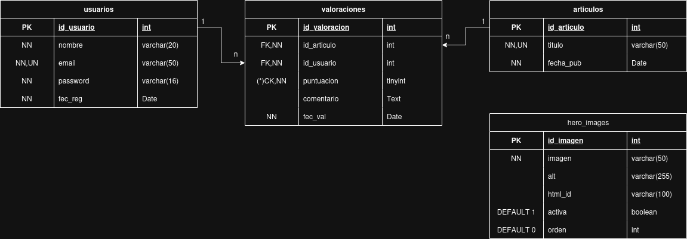

# Documentación de la Base de Datos  
## Criptojourney.org

---

## 1. Introducción

Esta documentación describe la estructura y funcionamiento de la base de datos utilizada en Criptojourney.org.
La base de datos se emplea exclusivamente para gestionar el **sistema de inicio de sesión** y el **sistema de valoraciones de artículos**.

---

## 2. Objetivo de la Base de Datos

- Gestionar usuarios registrados y su autenticación.
- Permitir a los usuarios valorar artículos de criptografía y acceder a la wiki interna de la web.
- Mantener la integridad, seguridad y consistencia de los datos.

---

## 3. Tecnología

- **Tipo de base de datos:** Relacional.
- **SGBD:** PHPMyAdmin(MySQL). 

---

## 4. Modelo Entidad–Relación (EER)

### 4.1 Entidades
- **Usuario**
- **Artículo**
- **Valoración**

### 4.2 Relaciones
- Un **usuario** puede realizar **varias valoraciones**.
- Un **artículo** puede recibir **varias valoraciones**.
- Cada **valoración** pertenece a **un único usuario** y **un único artículo**.

### 4.3 Diagrama EER (ASCII)




---

## 5. Modelo Relacional

---

### 5.1 Tabla `usuarios`

Almacena la información de los usuarios registrados en la web.

| Campo       | Tipo          | Restricciones                     | Descripción                          |
|------------|---------------|----------------------------------|--------------------------------------|
| id_usuario | INT           | PK, AUTO_INCREMENT               | Identificador único del usuario      |
| nombre     | VARCHAR(50)   | NOT NULL                         | Nombre del usuario                   |
| email      | VARCHAR(100)  | NOT NULL, UNIQUE                 | Correo electrónico                   |
| password   | VARCHAR(255)  | NOT NULL                         | Contraseña cifrada (hash)            |
| fec_reg  | DATETIME      | NOT NULL, DEFAULT CURRENT_TIMESTAMP | Fecha de registro                    |

---

### 5.2 Tabla `articulos`

Contiene los artículos informativos sobre criptografía.

| Campo       | Tipo          | Restricciones                     | Descripción                          |
|------------|---------------|----------------------------------|--------------------------------------|
| id_articulo| INT           | PK, AUTO_INCREMENT               | Identificador del artículo           |
| titulo     | VARCHAR(50)  | NOT NULL                         | Título del artículo                  |
| fec_pub  | DATETIME      | NOT NULL, DEFAULT CURRENT_TIMESTAMP | Fecha de publicación                 |

---

### 5.3 Tabla `valoraciones`

Registra las valoraciones realizadas por los usuarios sobre los artículos.

| Campo         | Tipo     | Restricciones                                             | Descripción                         |
|---------------|----------|-----------------------------------------------------------|-------------------------------------|
| id_valoracion | INT      | PK, AUTO_INCREMENT                                        | Identificador de la valoración      |
| id_usuario    | INT      | FK → usuarios(id_usuario), NOT NULL                      | Usuario que realiza la valoración   |
| id_articulo   | INT      | FK → articulos(id_articulo), NOT NULL                    | Artículo valorado                   |
| puntuacion    | TINYINT  | NOT NULL, CHECK (puntuacion BETWEEN 1 AND 5)             | Puntuación del 1 al 5               |
| comentario    | TEXT     | NULL                                                      | Comentario opcional                 |
| fec_val     | DATETIME | NOT NULL, DEFAULT CURRENT_TIMESTAMP                      | Fecha de la valoración              |

---

## 6. Reglas de Negocio

- Un usuario solo puede valorar artículos si está autenticado.
- Un usuario solo puede acceder a la wiki de la web si esta autenticado.
- La puntuación de una valoración debe estar entre 1 y 5.
- Un usuario no debería valorar el mismo artículo más de una vez (restricción lógica desde la aplicación).
- Las contraseñas nunca se almacenan en texto plano.

---

## 7. Seguridad

- Uso de **hash seguro** para contraseñas.
- Validación de datos de entrada para prevenir SQL Injection.
- Uso de claves foráneas para mantener integridad referencial.
- Acceso restringido a la base de datos mediante credenciales seguras.

---

## 8. Creación de base de datos y tablas

### 8.1 Script SQL
```sql
    -- ===========================================
-- CREACIÓN DE LA BASE DE DATOS
-- ===========================================

CREATE DATABASE IF NOT EXISTS criptojourney_db;
USE criptojourney_db;

-- ===========================================
-- CREACIÓN DE LA TABLA USUARIOS
-- ===========================================

CREATE TABLE IF NOT EXISTS usuarios
(
	id_usuario INTEGER AUTO_INCREMENT PRIMARY KEY,
	nombre VARCHAR(20) NOT NULL,
	email VARCHAR(50) NOT NULL UNIQUE,
	password VARCHAR(255) NOT NULL,
	fec_reg DATETIME NOT NULL DEFAULT CURRENT_TIMESTAMP
) COMMENT = 'Tabla que almacena los usuarios  registrados. Tiene como clave primaria un id único 
							que se auto incrementa por cada nuevo usuario, la contraseña es guardada en hash 
							para la seguridad del usuario';

-- ===========================================
-- CREACIÓN DE LA TABLA ARTICULOS
-- ===========================================

CREATE TABLE IF NOT EXISTS articulos
(
	id_articulo INTEGER AUTO_INCREMENT PRIMARY KEY,
	titulo VARCHAR(50) NOT NULL UNIQUE ,
	fec_pub DATETIME NOT NULL DEFAULT CURRENT_TIMESTAMP
) COMMENT = 'Tabla que almacena los artículos de la pagina web. Tiene como clave primaria un identificador único
							que se auto incrementa por cada nuevo artículo introducido, el titulo es único, no se repiten artículos';

-- ===========================================
-- CREACIÓN DE LA TABLA VALORACIONES
-- ===========================================

CREATE TABLE IF NOT EXISTS valoraciones
(
	id_valoracion INTEGER AUTO_INCREMENT PRIMARY KEY,
	id_articulo INTEGER,
	id_usuario INTEGER,
	puntuacion TINYINT NOT NULL,
	comentario TEXT  NOT NULL,
	fec_val DATETIME NOT NULL DEFAULT CURRENT_TIMESTAMP,
	
	-- -- Restricción que impide que un usuario valore el mismo artículo más de una vez.
	CONSTRAINT uni_valoraciones_id
	UNIQUE(id_usuario, id_articulo),
	
	-- Clave foránea que relaciona cada valoración con un artículo
	CONSTRAINT fk_valoraciones_articulos
	FOREIGN KEY (id_articulo)
	REFERENCES articulos(id_articulo)
	ON DELETE CASCADE
	ON UPDATE CASCADE,
	
	-- Clave foránea que relaciona cada valoración con un usuario
	CONSTRAINT fk_valoraciones_usuarios
	FOREIGN KEY (id_usuario)
	REFERENCES usuarios(id_usuario)
	ON DELETE CASCADE
	ON UPDATE CASCADE,
	
	-- Restricción que asegura que la puntuación esté comprendida entre 1 y 5
	CONSTRAINT ck_puntuacion
	CHECK ( puntuacion BETWEEN 1 and 5)
) COMMENT = 'Tabla que almacena las valoraciones de la pagina web. Tiene como clave primaria un identificador único
							que se auto incrementa por cada nueva valoración la cual es hecha por un usuario unico a un articulo unico, 
							la puntuación es entre 1 y 5';
```
